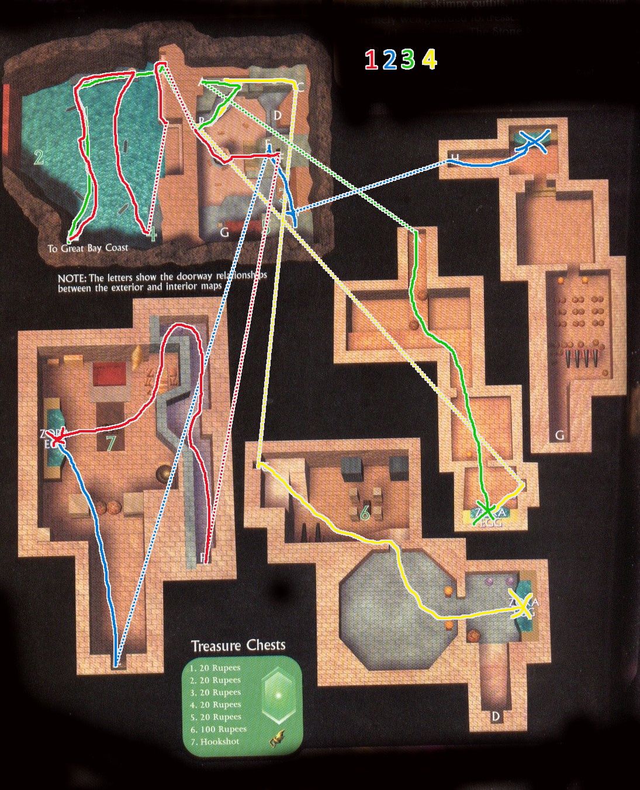

# Cycle 0+1
* Enter Clock Town
* Grandma Scarecrow
* Fairy 100 Magic Bombs Clock Town
* Song of Healing
* Song of Soaring Statue Stick
* D2 - R L S L L R - B L R - Potion
* B L R - Soaring Boat Ride
* Right Magic Bean
* Sonata of Awakening
* Enter Woodfall Temple
* Right Side Small Key
* Enter 2nd Floor
* Hero's Bow
* Boss Key
* Enter Odolwa
* Odolwa's Remains
* Bottle Target Game
* Mountain Village Owl Song of Time

# Cycle 2
* Soar Mountain Village, smash snow for bombs
* Enter Goron Shrine
* Lens of Truth
* R L R Goron Mask
* Lullaby Intro
* Goron Lullaby
* Enter Snowhead Temple
* Right Side Small Key
* Left Side Key Snowball
* Across Twice Fire Arrow
* Fall Middle Raise Pillar
* Punch Blocks Boss Key
* Fall Middle Enter Boss
* Goht's Remains
* Get Powder Keg

# Cycle 3+
* New Day Money Keg Ranch
* Epona's Song
* Gorman Race Garo Mask
* Captain's Hat
* Night First Day Enter Grave
* Song of Storms Inverted
* Zora Mask
* Great Bay Owl Statue
* Upstairs Hookshot
* 
* Hookshot Room
* Backflip
* Soaring Drop Off Eggs
* Directly left, 2 Hookshots
* Directly left, 3 Hookshots
* Drop Off Two More Eggs
* Zora Egg #5 Top Eel
* Zora Egg #6 Across Right
* Drop Two More
* Zora Egg #7 Bottom Right
## Great Bay Temple
* get fairy in barrel on left
* 15 bombs is good
* enter
* valve in water on right
* on east elevator, use spout
* north into big spinny
* upper red path
* leave again
* door
* key in chest underwater
* go in current
* lower red path
* climb red pipe, locked door
* Miniboss Wart
* Fight with Bombs and Fire Arrows to the Eye
* ICE ARROWS
* return 2 rooms, jump into center via frozen octorok, valve
* leave due south
* upper red path
* ice arrow to high door
* frozen chuchu to valve
* through next rooms
* ice arrows to northern path
* Miniboss Gekko BIG KEY, soaring
* hookshot to northwest ceiling corner, crank big red
* crank big yellow
* big spinny room, freeze waterfall, ladder, door
* hookshot, 2 arrows, valve, back where came
* middle green path
* northwestern elevator, freeze waterfall
* use frozen wheel to door
* unfreeze second seesaw while on it
* jump over, unfreeze
* green valve
* go on ground seesaw, unfreeze
* leave, bottom green path
* follow green pipe, green valve, jump over spout, Gyorg
### Gyorg
* shoot with arrows in first phase
* postpone water combat as long as possible with ice platforms, pelt with arrows
* cut bomb into him close, DONT GET VORED
## Ikana
* Keg, Fish, Nut (80 rups)
* Grotto Milk (in south stump)
* Bean (southern swamp salesman
* Ikana Owl Statue
* Song of Storms
* Gibdo Mask
* Right Beans D, Left Fish
* Right Nuts D, Left Bombs D, Fight Big Poe
* Backtrack to Fish Door, Forward Poe D, Forward Milk D
* Mirror Shield
* Left Side Toss Keg Enter
* Elegy of Emptiness
* First Switch Elegy Zora
* Third Switch Elegy Link
* Hookshot 1st Switch Elegy Link
* Hookshot Hookshot Step
* Stand on Block Elegy Link
* **fill fairies**, refill on pots by STT
* Right Switch Link
* Block, Elegy
* Enter Temple
## Stone Tower Temple
* Left, bomb wall, block out, right on switch
* go on beeg switch, goron elegy
* around next corner, zora elegy
* left, link elegy
* bomb floor in new room, fall
* kill all armos with goron, SMALL KEY
* back up, locked door
* dolphin jump onto opposite ledge
* deku hop to switch, SMALL KEY
* dive to east, surface, locked door
* stored light puzzle (8 ticks), next room
* deku flight, next room, GARO MASTER, LIGHT ARROWS, soaring
* **refill fairies**
* flip temple, right, light block
* deku flight to high, through hole, switch, SMALL KEY
* deku flight to TOP, locked door
* flip, goron over, flip
* do this whole dang pushing puzzle, into door
* WIZZROBE with Light Arrows
* hookshot to new chest, deku over gap
* deku into right hole, kill armos flippers as needed
* southmost switch, Link
* left chest, small key
* leave to east, shoot spikebombs, deku in there, deku to east
* Batman, light arrows to scare bats, hit
* BOSS KEY, leave again, deku back to west, southwest door
* flip boy, switch+
* **refill fairies**
* hookshot to new chest
* 4 light arrows on eyegore
* switch, hookshot to chest, hookshot to target, TWINMOLD
### Twinmold
* focus on blue, normal arrows
* GIANT MASK
* hit enough in one cycle
* grab tail, SPIN PAD
* throw boulders
## Final
* fill to two faires with ikana bush
* enter clock tower
* oath to order
* talk main kid
### Mask
* zora shoot, goron punch
* Light or normal arrow remains
* mirror shield beam of majora
### Incarnation + Wrath
* shoot with light or normal, goron punch
